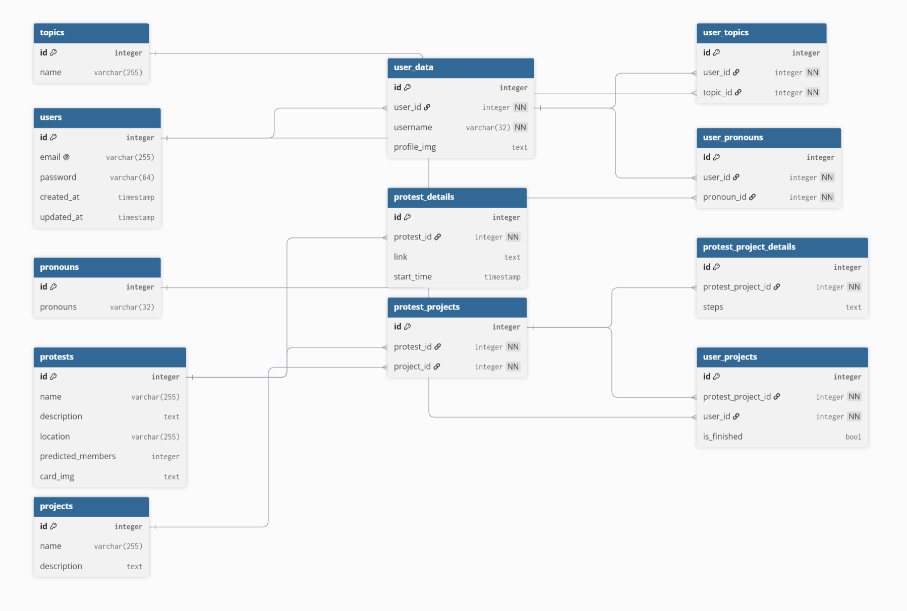

# SupporT — TLE4 Expo / React Native Project

SupporT is een mobiele applicatie waarmee jongeren demonstraties kunnen ontdekken, opslaan en op een laagdrempelige manier kunnen bijdragen aan maatschappelijke acties. De app richt zich niet alleen op fysiek meedoen aan demonstraties, maar ook op creatieve vormen van support zoals stickers ontwerpen, spandoeken maken en donaties ondersteunen.

De applicatie is gemaakt voor TLE4 en is gebouwd met Expo, React Native en een Express-backend. De frontend haalt data op uit de backend, zoals demonstraties, gebruikers, projecten en profielgegevens.

---

## Inhoudsopgave

1. Projectoverzicht
2. Gebruikte technieken
3. Benodigdheden
4. Installatie-instructies
5. Project starten
6. Backend en API
7. Projectstructuur
8. ERD en database-uitleg
9. Belangrijke app-functionaliteiten
10. Authenticatie en gebruikersrollen
11. Admin-functionaliteit
12. Afbeeldingen en uploads
13. Edge cases
14. Veelvoorkomende problemen
15. Testgegevens
16. Samenvatting normale setup-flow

---

## 1. Projectoverzicht

SupporT helpt gebruikers om demonstraties en maatschappelijke acties overzichtelijk te vinden. Gebruikers kunnen demonstraties bekijken, zoeken, filteren, opslaan in hun agenda en details bekijken. Daarnaast laat de app zien hoe iemand op een creatieve manier kan bijdragen aan een actie.

Voorbeelden van creatieve bijdragen zijn:

* Stickers ontwerpen
* Spandoeken maken
* Donaties ondersteunen
* Acties bekijken die gekoppeld zijn aan een demonstratie

De app gebruikt een backend om demonstraties, gebruikers, projecten en profielinformatie op te halen en te beheren.

Backend server:

```txt
http://145.24.237.86:8000
```

---

## 2. Gebruikte technieken

De frontend is gebouwd met:

```txt
Expo
React Native
React Navigation
NativeWind / Tailwind-style styling
twrnc
Expo Vector Icons
AsyncStorage
Expo Image Picker
DateTimePicker
React Native Maps
```

De backend gebruikt:

```txt
Node.js
Express
MySQL / database via VPS
```

De app gebruikt API-calls om data uit de backend op te halen en te bewerken.

---

## 3. Benodigdheden

Zorg dat je het volgende hebt geïnstalleerd:

```txt
Node.js
npm
Expo Go app op je telefoon
Git
```

Aanbevolen Node-versie:

```txt
Node 18 LTS
```

Controleer je versies met:

```bash
node -v
npm -v
```

Als je met `nvm` werkt, gebruik dan:

```bash
nvm install 18
nvm use 18
```

---

## 4. Installatie-instructies

Clone eerst de repository:

```bash
git clone <repository-url>
```

Ga daarna naar de projectmap:

```bash
cd <project-map>
```

Installeer de bestaande dependencies uit `package.json`:

```bash
npm install
```

Controleer daarna of Expo de juiste versies gebruikt:

```bash
npx expo install --fix
```

Start de app daarna met:

```bash
npx expo start
```

Als er cacheproblemen zijn, start dan met:

```bash
npx expo start -c
```

---

## 5. Project starten

Na het starten van Expo kun je kiezen hoe je de app opent:

```txt
a = Android emulator
i = iOS simulator
w = Web browser
```

Je kunt ook de QR-code scannen met de Expo Go app op je telefoon.

Voor mobiel testen is Expo Go de makkelijkste optie.

Let op: sommige onderdelen, zoals `react-native-maps`, werken niet goed op web. Test de map-functionaliteit daarom bij voorkeur op mobiel.

---

## 6. Backend en API

De app maakt verbinding met deze backend:

```txt
http://145.24.237.86:8000
```

Belangrijke endpoints:

```txt
GET    /users
POST   /users
GET    /users/:id
GET    /users/:id/details
PUT    /users/:id
PUT    /users/:id/details
DELETE /users/:id
GET    /users/image/:token

GET    /protests
POST   /protests
GET    /protests/:id
GET    /protests/:id/details
GET    /protests/image/:token

GET    /projects
POST   /projects
GET    /projects/:id

GET    /protest_projects
POST   /protest_projects
GET    /protest_projects/:id
```

De API-configuratie staat in:

```txt
components/services/ProtestApi.js
```

Voorbeeld:

```js
const API_BASE_URL = "http://145.24.237.86:8000";
```

De app moet rekening houden met het feit dat sommige backend-routes nog niet volledig af zijn. Daarom is het belangrijk dat optionele data niet direct de hele app laat crashen.

---

## 7. Projectstructuur

De globale projectstructuur ziet er ongeveer zo uit:

```txt
assets/
components/
    actions/
    filters/
    forms/
    layout/
    services/
context/
data/
screens/
App.js
global.css
package.json
tailwind.config.js
babel.config.js
README.md
```

Belangrijke bestanden:

```txt
App.js
context/AuthContext.js

components/layout/AppNavigator.js
components/layout/AppHeader.js

components/actions/ActionCard.js
components/forms/LoginForm.js
components/forms/RegistryForm.js
components/forms/DonationForm.js
components/forms/ProtestForm.js
components/PreviewModal.js
components/filters/FilterModal.js
components/services/ProtestApi.js

screens/ActionScreen.js
screens/HomeScreen.js
screens/AgendaScreen.js
screens/DetailScreen.js
screens/LoginScreen.js
screens/RegistryScreen.js
screens/ProfileScreen.js
screens/AdminScreen.js
screens/MapScreen.native.js
screens/MapScreen.web.js
```

---

## 8. ERD en database-uitleg

De database bestaat uit meerdere tabellen die samen de gebruikers, demonstraties, projecten en acties ondersteunen.



### Users

De `users` tabel bevat de hoofdgegevens van een gebruiker.

Voorbeelden van velden:

```txt
id
email
username
password
is_admin
created_at
updated_at
```

Deze tabel wordt gebruikt voor login, registratie, profielgegevens en admin-rechten.

Voorbeelden van endpoints:

```txt
GET /users
GET /users/:id
PUT /users/:id
POST /users
```

Bij het bewerken van username, email of password wordt `PUT /users/:id` gebruikt.

---

### User details

De `user_details` of details-route bevat extra informatie van een gebruiker, zoals een profielfoto.

Voorbeelden van velden:

```txt
id
user_id
profile_img
created_at
updated_at
```

Voorbeelden van endpoints:

```txt
GET /users/:id/details
PUT /users/:id/details
GET /users/image/:token
```

De profielfoto wordt niet rechtstreeks als normale URL opgeslagen, maar kan als token worden opgehaald via:

```txt
GET /users/image/:token
```

---

### Protests

De `protests` tabel bevat de hoofdgegevens van een demonstratie.

Voorbeelden van velden:

```txt
id
name
subtitle
location
predicted_members
card_img
latitude
longitude
created_at
updated_at
```

Voorbeelden van endpoints:

```txt
GET /protests
POST /protests
GET /protests/:id
GET /protests/image/:token
```

De app gebruikt deze data onder andere op de homepagina, agenda en detailpagina.

---

### Protest details

De details van een protest bevatten extra informatie zoals beschrijving, link en starttijd.

Voorbeelden van velden:

```txt
id
protest_id
description
link
start_time
created_at
updated_at
```

Voorbeelden van endpoints:

```txt
GET /protests/:id/details
```

Deze data wordt gebruikt om meer informatie te tonen op de detailpagina en in de agenda.

---

### Projects

De `projects` tabel bevat creatieve bijdragevormen, zoals stickers, spandoeken of donaties.

Voorbeelden van velden:

```txt
id
name
description
created_at
updated_at
```

Voorbeelden van endpoints:

```txt
GET /projects
POST /projects
GET /projects/:id
```

---

### Protest projects

De `protest_projects` tabel koppelt demonstraties aan projecten.

Voorbeeld:

```txt
protest_id
project_id
```

Hierdoor kan één demonstratie meerdere creatieve acties hebben, zoals stickers of spandoeken.

Voorbeelden van endpoints:

```txt
GET /protest_projects
POST /protest_projects
GET /protest_projects/:id
```

---

### Relaties in het ERD

De belangrijkste relaties zijn:

```txt
users 1 - 1 user_details

protests 1 - 1 protest_details

protests 1 - n protest_projects

projects 1 - n protest_projects
```

Simpel gezegd:

* Een gebruiker heeft extra profielgegevens.
* Een demonstratie heeft extra detailinformatie.
* Een demonstratie kan gekoppeld zijn aan meerdere creatieve projecten.
* Een project kan bij meerdere demonstraties horen.

---

## 9. Belangrijke app-functionaliteiten

### Homepagina

De homepagina toont beschikbare demonstraties uit de backend. Gebruikers kunnen demonstraties zoeken en filteren.

Functionaliteiten:

```txt
Demonstraties ophalen uit API
Zoeken op naam, locatie of onderwerp
Filteren op type actie
Preview openen
Navigeren naar detailpagina
```

---

### Preview modal

De preview modal toont kort de belangrijkste informatie van een demonstratie voordat de gebruiker naar de detailpagina gaat.

Voorbeelden van informatie:

```txt
Naam
Locatie
Datum
Tijd
Korte beschrijving
Aantal verwachte deelnemers
```

---

### Detailpagina

De detailpagina toont meer informatie over een demonstratie.

Voorbeelden:

```txt
Beschrijving
Locatie
Datum en tijd
Link
Creatieve bijdrage-opties
```

---

### Agenda

De agenda toont opgeslagen of geplande demonstraties. De kalender kan activiteiten markeren op basis van datum.

Functionaliteiten:

```txt
Kalenderweergave
Vandaag-knop
Volgende/vorige maand
Activiteitenlijst
Preview openen vanuit agenda
```

---

### Profiel

De profielpagina toont en bewerkt gebruikersgegevens.

Hoofdgegevens komen uit:

```txt
GET /users/:id
```

Extra profieldata komt uit:

```txt
GET /users/:id/details
```

Bij bewerken:

```txt
PUT /users/:id
```

wordt gebruikt voor:

```txt
username
email
password
is_admin
```

En:

```txt
PUT /users/:id/details
```

wordt gebruikt voor:

```txt
profile_img
```

---

## 10. Authenticatie en gebruikersrollen

De app gebruikt `AuthContext` voor login-state.

Bestand:

```txt
context/AuthContext.js
```

De ingelogde gebruiker wordt lokaal opgeslagen met AsyncStorage. Hierdoor blijft de gebruiker bekend nadat de app opnieuw wordt geopend.

Gebruikersrollen:

```txt
is_admin = 0 → normale gebruiker
is_admin = 1 → admin
```

Als een gebruiker admin is, kan de adminpagina zichtbaar worden in de navigatie.

---

## 11. Admin-functionaliteit

De adminpagina wordt gebruikt om nieuwe demonstraties aan te maken.

Bestanden:

```txt
screens/AdminScreen.js
components/forms/ProtestForm.js
```

De admin kan data invullen zoals:

```txt
Naam
Beschrijving
Locatie
Verwachte deelnemers
Link
Datum en tijd
Latitude
Longitude
Afbeelding
```

Nieuwe demonstraties worden aangemaakt met:

```txt
POST /protests
```

Als er een afbeelding wordt geüpload, gebruikt de app `FormData`.

Belangrijk:

```txt
Stel bij FormData niet handmatig Content-Type in.
React Native moet dit zelf doen.
```

---

## 12. Afbeeldingen en uploads

Afbeeldingen worden niet altijd als normale URL opgeslagen. De backend gebruikt tokens voor afbeeldingen.

Voor protestafbeeldingen:

```txt
GET /protests/image/:token
```

Voor profielfoto’s:

```txt
GET /users/image/:token
```

Voorbeeld:

```txt
card_img = token voor protestafbeelding
profile_img = token voor profielfoto
```

De frontend moet daarom image tokens omzetten naar een volledige API-url.

Voorbeeld:

```js
const imageUrl = `${API_BASE_URL}/protests/image/${card_img}`;
```

of:

```js
const profileUrl = `${API_BASE_URL}/users/image/${profile_img}`;
```

---

## 13. Edge cases

Tijdens het bouwen van de app zijn er meerdere situaties waar de app goed mee om moet gaan.

### 1. Backend is offline

Als de backend niet bereikbaar is, mag de app niet crashen. De gebruiker moet een duidelijke foutmelding krijgen.

Voorbeeld:

```txt
Kon demonstraties niet laden.
Probeer het opnieuw.
```

---

### 2. Endpoint bestaat nog niet

Sommige endpoints kunnen nog ontbreken of een 404 geven. De app moet hier veilig mee omgaan.

Voorbeeld:

```txt
GET /users/:id/details geeft 404
```

In dat geval toont de app nog steeds de basisgegevens uit:

```txt
GET /users/:id
```

---

### 3. Geen profielfoto

Als `profile_img` leeg of null is, toont de app een standaard profielicoon.

Voorbeeld:

```txt
profile_img = null
```

Dan toont de app geen kapotte afbeelding, maar een fallback.

---

### 4. Geen protestafbeelding

Als `card_img` leeg is, gebruikt de app een standaardafbeelding of fallback.

Voorbeeld:

```txt
card_img = null
```

---

### 5. Geen datum of starttijd

Sommige demonstraties hebben mogelijk nog geen `start_time`. In dat geval moet de app “Datum onbekend” of “Tijd onbekend” tonen.

De agenda mag niet crashen als een datum ontbreekt.

---

### 6. Filter zonder resultaten

Als een gebruiker filtert en er zijn geen resultaten, moet de app een lege staat tonen.

Voorbeeld:

```txt
Geen demonstraties gevonden.
Pas je filters aan.
```

---

### 7. Web en react-native-maps

`react-native-maps` werkt niet goed op Expo Web. Daarom gebruikt de app aparte bestanden:

```txt
MapScreen.native.js
MapScreen.web.js
```

De native versie gebruikt de echte kaart. De webversie toont een fallback.

---

### 8. Wachtwoord wijzigen

Het wachtwoord hoort bij de `users` tabel en wordt dus aangepast via:

```txt
PUT /users/:id
```

De `details` route is alleen bedoeld voor extra profielinformatie zoals:

```txt
profile_img
```

De frontend kan het oude wachtwoord niet goed vergelijken, omdat de backend een bcrypt hash terugstuurt. De echte controle van het oude wachtwoord hoort eigenlijk in de backend te gebeuren.

---

### 9. Adminrechten niet direct zichtbaar

Als `is_admin` niet goed wordt opgeslagen in de login-state, kan het lijken alsof een admin geen adminpagina heeft.

De app moet daarom controleren op:

```txt
is_admin = 1
isAdmin = true
role = admin
```

---

### 10. Upload zonder afbeelding

Een admin moet ook een demonstratie kunnen aanmaken zonder afbeelding. In dat geval wordt `card_img` leeg of null opgeslagen en gebruikt de app een fallback-afbeelding.

---

## 14. Veelvoorkomende problemen

### Expo cacheproblemen

Gebruik:

```bash
npx expo start -c
```

---

### Dependencies opnieuw installeren op macOS/Linux

```bash
rm -rf node_modules
npm install
npx expo start -c
```

---

### Dependencies opnieuw installeren op Windows

```bash
rmdir /s /q node_modules
npm install
npx expo start -c
```

---

### Expo dependency versies herstellen

```bash
npx expo install --fix
```

---

### Web bundling error met react-native-maps

Foutmelding:

```txt
Importing react-native internals is not supported on web
```

Oplossing:

```txt
Gebruik MapScreen.native.js voor mobiel.
Gebruik MapScreen.web.js voor web.
Importeer react-native-maps niet in de webversie.
```

---

### API-data wordt niet getoond

Check eerst de backend in Postman:

```txt
GET http://145.24.237.86:8000/protests
GET http://145.24.237.86:8000/users
GET http://145.24.237.86:8000/projects
GET http://145.24.237.86:8000/protest_projects
```

Als een endpoint `404` geeft, bestaat de route nog niet of is de backend niet goed opgestart.

---

### Registratie geeft unknown column error

Voorbeeld:

```txt
Unknown column 'profile_pfp' in 'field list'
```

Dit betekent dat de backend naar een kolom schrijft die niet bestaat.

Correct:

```txt
user_details.profile_img
```

Niet correct:

```txt
profile_pfp
```

Registratie moet alleen de basisgebruiker aanmaken met:

```txt
username
email
password
is_admin
```

Extra profielgegevens horen later bij:

```txt
PUT /users/:id/details
```

---

### Backend server stopt vanzelf

Als de Express-server direct stopt na:

```txt
Server running on port 8000
```

controleer dan:

```bash
node --trace-uncaught index.js
```

Check ook of poort 8000 al bezet is:

```bash
sudo lsof -i :8000
```

Als de server met PM2 draait:

```bash
pm2 logs
pm2 restart all
```

---

## 15. Testgegevens

Er zijn testaccounts beschikbaar om de app te testen.

Normale gebruiker:

```txt
Email: test@test.nl
Wachtwoord: testing
Rol: gebruiker
```

Admin gebruiker:

```txt
Email: admin@test.nl
Wachtwoord: testing
Rol: admin
```

Met de normale gebruiker kan de app getest worden als gewone gebruiker.

Met de admin gebruiker kan de adminfunctionaliteit getest worden.

---

## 16. Samenvatting normale setup-flow

Voor een normale installatie is meestal dit genoeg:

```bash
npm install
npx expo install --fix
npx expo start -c
```

Als er packages missen, installeer dan alleen wat de terminal aangeeft.

---

## 17. Alles handmatig installeren

Gebruik dit alleen als de projectinstallatie niet goed werkt of als dependencies ontbreken.

```bash
npm install
npm install expo react react-native
npm install nativewind tailwindcss
npm install twrnc
npm install @react-navigation/native @react-navigation/stack @react-navigation/bottom-tabs
npx expo install @expo/vector-icons
npx expo install react-native-screens react-native-safe-area-context react-native-gesture-handler
npx expo install @react-native-async-storage/async-storage
npx expo install expo-image-picker
npx expo install @react-native-community/datetimepicker
npx expo install expo-blur
npx expo install react-native-maps
npm install --save-dev babel-preset-expo
npx expo start -c
```

---

## 18. Belangrijke keuzes in het project

Tijdens het bouwen zijn er een paar bewuste keuzes gemaakt.

### NativeWind en styling

De app gebruikt vooral `className` styling via NativeWind. Voor dynamische styling wordt `style={{ ... }}` gebruikt.

Regel:

```txt
Gebruik className voor vaste styling.
Gebruik style voor dynamische styling.
```

---

### API fallback

Niet alle backendroutes zijn altijd beschikbaar. Daarom gebruikt de frontend op sommige plekken fallbackdata of lege states. Dit zorgt ervoor dat de app niet meteen crasht als een optionele route ontbreekt.

---

### Afbeeldingstokens

Afbeeldingen worden via tokens opgehaald in plaats van directe bestandslinks. Hierdoor moet de frontend tokens omzetten naar API-routes.

---

### Wachtwoord en profielgegevens

De gebruikersgegevens zijn verdeeld over twee endpoints:

```txt
/users/:id
/users/:id/details
```

De hoofdgegevens staan in `/users/:id`.

De extra profielgegevens staan in `/users/:id/details`.

Daarom wordt wachtwoord aangepast via `/users/:id`, terwijl de profielfoto via `/users/:id/details` gaat.

---

## 19. Conclusie

SupporT is een Expo/React Native app die jongeren helpt om demonstraties te ontdekken en op verschillende manieren impact te maken. De app gebruikt een Express-backend voor gebruikers, demonstraties, projecten en profielinformatie. Door duidelijke fallbacklogica en edge case-afhandeling blijft de app bruikbaar, ook wanneer sommige backenddata ontbreekt of nog niet volledig beschikbaar is.
